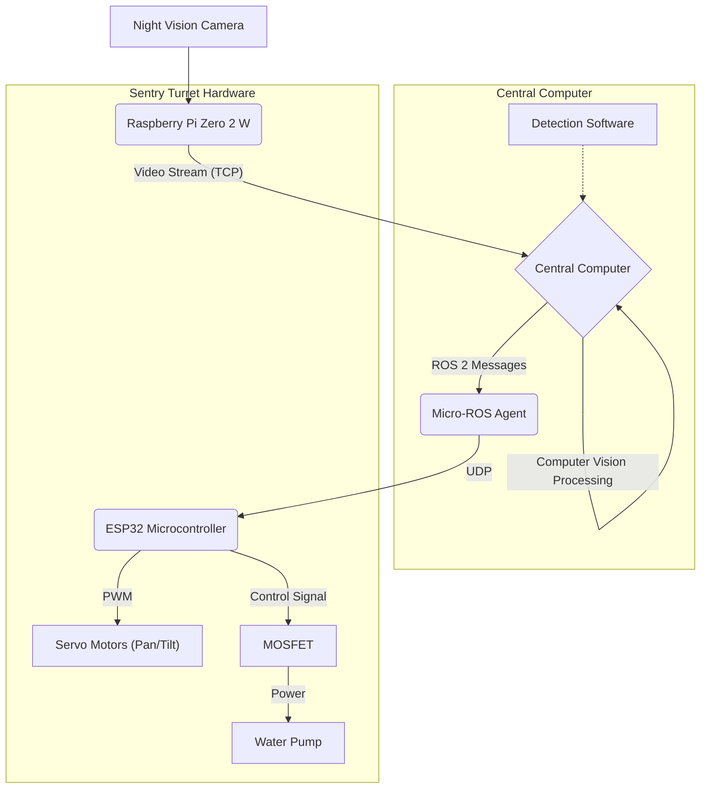

# [WIP] Aqua-Sentinel: A Smart Sentry Turret System 🛡️

[](https://docs.ros.org/en/jazzy/)
[](https://micro.ros.org/)
[](https://platformio.org/)
[](https://www.python.org/)
[](https://opencv.org/)

## Introduction

Aqua-Sentinel is an automated sentry turret system designed to monitor and protect various spaces — such as cars, gardens, or backyards, from unwanted visitors like martens. It integrates a Raspberry Pi Zero 2 W for video streaming, an ESP32 microcontroller for precise hardware control (servos, pump), and a central computer for computer vision processing and system orchestration. Equipped with a night vision camera, it monitors areas in real-time. When the computer vision software identifies trespassers, it commands the ESP32 (via ROS 2 and Micro-ROS) to aim a servo-controlled water nozzle and deliver a gentle splash as a deterrent. Whether you’re safeguarding your vehicle from pesky martens or your flower beds from curious raccoons, Aqua-Sentinel combines technology and a non-invasive deterrent into one effective, tech-savvy package.

---

## Table of Contents

* [Introduction](#introduction)
* [Features](#features)
* [System Architecture](#system-architecture)
* [Components](#components)
    * [Hardware](#hardware)
    * [Software](#software)
* [Setup](#setup)
    * [Prerequisites](#prerequisites)
    * [Raspberry Pi Setup](#raspberry-pi-setup)
    * [ESP32 Setup](#esp32-setup)
    * [Central Computer Setup](#central-computer-setup)
* [Usage](#usage)
    * [Starting the Micro-ROS Agent](#starting-the-micro-ros-agent)
    * [Starting the Camera Stream](#starting-the-camera-stream)
    * [Running the Detection Software](#running-the-detection-software)
    * [Manual Servo Control (for testing/calibration)](#manual-servo-control-for-testingcalibration)
    * [Adjusting Detection and Water Splash](#adjusting-detection-and-water-splash)

---

## Features

* **Real-time Monitoring**: Streams live video using a night vision camera, ensuring visibility especially at night.
* **Computer Vision Detection**: Employs AI-driven object detection to spot animals or other targets.
* **Servo-Controlled Aiming**: Precisely adjusts the camera and water nozzle using servo motors controlled by the ESP32.
* **Water-Based Deterrence**: Uses a piston pump to deliver a harmless water splash to scare off visitors.
* **ROS 2 and Micro-ROS Integration**: Facilitates robust, standardized communication and control across all components (Raspberry Pi, ESP32, Central Computer).
* **Modular Design**: Allows for components to be upgraded or modified (e.g., different cameras, detection algorithms).

---

## System Architecture

Aqua-Sentinel operates through a distributed system:

1.  **Raspberry Pi Zero 2 W**: Streams video from the night vision camera over the network using `libcamera-vid`.
2.  **Central Computer**:
    * Receives the video stream.
    * Runs the primary computer vision software to detect targets.
    * Hosts the ROS 2 network and the Micro-ROS agent.
    * Publishes control commands (e.g., servo positions, pump activation) to ROS 2 topics.
3.  **ESP32 Microcontroller**:
    * Connects to the Wi-Fi network.
    * Runs a Micro-ROS client, subscribing to control commands from the central computer.
    * Drives the servo motors for aiming and the water pump (via a MOSFET for safe power handling).

Communication between the central computer and the ESP32 is handled by ROS 2 messages, with Micro-ROS bridging the gap to the microcontroller.



-----

## Components

### Hardware

  * **Raspberry Pi Zero 2 W**: The brain for video streaming. Compact yet powerful enough for this task.
  * **Night Vision Camera**: A camera module compatible with Raspberry Pi, capable of capturing clear footage in low-light conditions.
  * **ESP32 Microcontroller**: Manages servo motor control and interfaces with the water pump. Chosen for its Wi-Fi capabilities and processing power for Micro-ROS.
  * **Servo Motors**: Two units—one for camera positioning/pan, one for aiming the water nozzle/tilt.
  * **Piston Pump**: Extracted from an electric water pump or similar, used to splash water as a deterrent.
  * **Logic Level MOSFET (e.g., IRL540N)**: Essential for safely controlling the water pump, as the ESP32 cannot directly provide the required current. The ESP32 signals the MOSFET, which then switches the higher current for the pump.
  * **Central Processing Computer**: A more powerful machine (e.g., a laptop or desktop running Ubuntu 24.04) to run the detection software, ROS 2, and the Micro-ROS agent.
  * **Power Supplies**: Appropriate power supplies for the Raspberry Pi, ESP32, servos, and pump.
  * **Miscellaneous**: Wires, mounting hardware, tubing for water.

### Software

  * **Raspberry Pi OS Lite**: Operating system for the Raspberry Pi.
  * **`libcamera-apps` (`libcamera-vid`)**: For streaming video from the Raspberry Pi’s camera module.
  * **Ubuntu 24.04 (Recommended)**: For the central computer.
  * **ROS 2 Jazzy**: A robotics framework for communication between components.
  * **Micro-ROS**: Extends ROS 2 capabilities to the ESP32 microcontroller.
      * **Micro-ROS Agent**: Runs on the central computer to communicate with the ESP32.
      * **Micro-ROS Client Library**: Used in the ESP32 firmware.
  * **Computer Vision Libraries**: Tools like OpenCV on the central computer for detecting objects in the video feed. (Specific detection scripts like `detection_code.py` to be developed by the user).
  * **PlatformIO (or Arduino IDE with ESP32 Core)**: For developing and flashing firmware to the ESP32. The project includes `firmware_esp32/platformio.ini` and `firmware_esp32/src/main.cpp`.
  * **Python**: For helper scripts (e.g., `stream_receiver.py`, detection scripts).

-----

## Setup

### Raspberry Pi Setup

1.  **Install Raspberry Pi OS**:
2.  **Connect and enable Night Vision Camera**:
3.  **Install `libcamera-apps`**:

### ESP32 Setup

1.  **Install PlatformIO Core or Use Arduino IDE**
2.  **Set Up Micro-ROS on ESP32**
3.  **Connect Hardware**:
      * Connect servo motors to the designated GPIO pins on the ESP32 (e.g., GPIO 12, GPIO 13).
      * Connect the water pump's power line through the MOSFET, with the MOSFET's gate pin connected to a GPIO on the ESP32.
4.  **Build and Upload Firmware**:
      * **PlatformIO**: `pio run --target upload` from the `firmware_esp32` directory.
      * **Arduino IDE**: Compile and upload the sketch.

### Central Computer Setup

1.  **Install Ubuntu 24.04 (or compatible Linux distribution)**.

2.  **Install ROS 2 Jazzy Jellyfish**:
    Follow the [official ROS 2 Jazzy installation guide](https://docs.ros.org/en/jazzy/Installation/Ubuntu-Install-Debs.html). For desktop install:

    ```bash
    sudo apt update
    sudo apt install ros-jazzy-desktop
    source /opt/ros/jazzy/setup.bash # Add to your .bashrc
    ```

3.  **Set Up Micro-ROS Agent**:

      * Create a Micro-ROS workspace:
        ```bash
        mkdir -p ~/microros_ws
        cd ~/microros_ws
        git clone -b jazzy [https://github.com/micro-ROS/micro_ros_setup.git](https://github.com/micro-ROS/micro_ros_setup.git) src/micro_ros_setup
        ```
      * Install dependencies and build:
        ```bash
        source /opt/ros/jazzy/setup.bash
        sudo apt update && rosdep update
        rosdep install --from-paths src --ignore-src -y
        colcon build
        source install/local_setup.bash # Add to your .bashrc if you want it persistent for this ws
        ```
      * Create and build the Micro-ROS agent:
        ```bash
        ros2 run micro_ros_setup create_agent_ws.sh
        ros2 run micro_ros_setup build_agent.sh
        source install/local_setup.bash # Source the agent's workspace
        ```

-----

## Usage

With everything set up, here’s how to operate Aqua-Sentinel. Ensure all devices are powered on and connected to the same network.

### 1\. Starting the Micro-ROS Agent

On the **central computer**, open a new terminal and start the Micro-ROS agent. The ESP32 will connect to this agent.

```bash
# Source ROS 2 Jazzy if not already in .bashrc
source /opt/ros/jazzy/setup.bash

# Source your Micro-ROS agent workspace setup (if not in .bashrc)
# cd ~/microros_ws # (This is the workspace where you built the agent, adjust if different)
# source install/local_setup.bash

# Run the agent
ros2 run micro_ros_agent micro_ros_agent udp4 --port 8888
```

Keep this terminal running. You should see messages when the ESP32 connects.

### 2\. Starting the Camera Stream

On the **Raspberry Pi**, initiate the video stream, making it listen for a TCP connection from the central computer:

```bash
libcamera-vid -t 0 --inline --listen -o tcp://0.0.0.0:8554
```

  * `-t 0`: Runs the stream indefinitely.
  * `--inline`: Includes H.264 headers in the stream (crucial for decoding).
  * `--listen`: Makes the Pi a TCP server, waiting for connections.
  * `-o tcp://0.0.0.0:8554`: Outputs to TCP, binding to all interfaces on port 8554.

You can adjust streaming parameters like resolution and framerate:

```bash
# Example with more parameters:
libcamera-vid -t 0 --width 640 --height 480 --framerate 15 --bitrate 1000000 --inline --listen -o tcp://0.0.0.0:8554
```

### 3\. Running the Detection Software
[WIP]

### 4\. Manual Servo Control (for testing/calibration)

You can test the servo and pump control by manually publishing messages to the ROS 2 topic the ESP32 subscribes to. For example, if the ESP32 subscribes to `/servo_positions` of type `geometry_msgs/msg/Vector3` where `x` is pan angle, `y` is tilt angle, and `z` is pump activation (e.g., 1 for on, 0 for off, or a duration):

On the **central computer**, in a new terminal (after sourcing ROS 2):

```bash
# Example: Set pan to 90 degrees, tilt to 45 degrees, and activate pump (z=1)
ros2 topic pub --once /servo_positions geometry_msgs/msg/Vector3 "{x: 90.0, y: 45.0, z: 1.0}"

# Example: Turn pump off (z=0)
ros2 topic pub --once /servo_positions geometry_msgs/msg/Vector3 "{x: 90.0, y: 45.0, z: 0.0}"
```